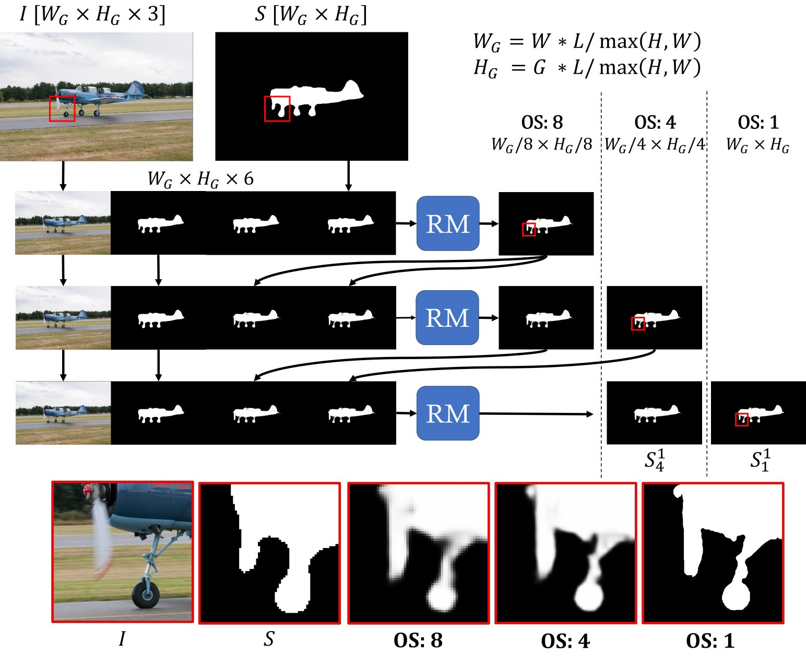
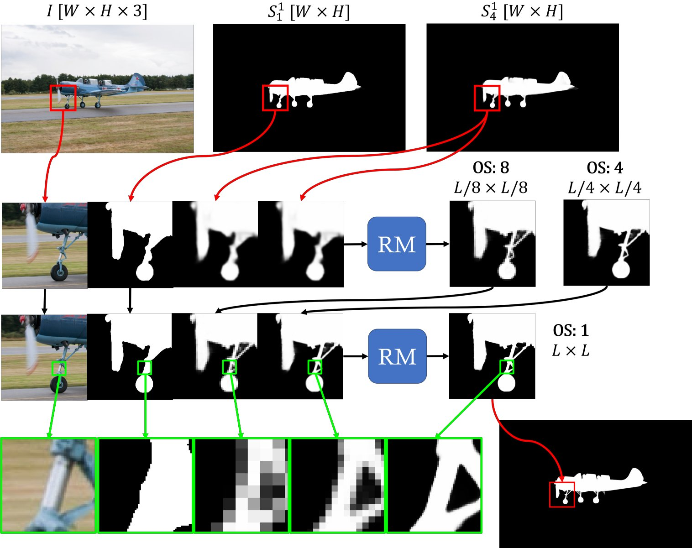
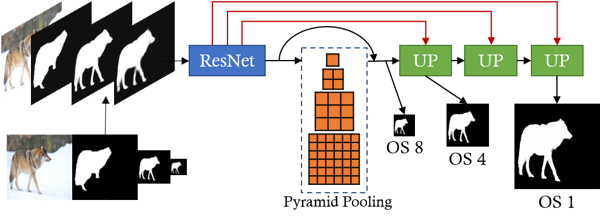
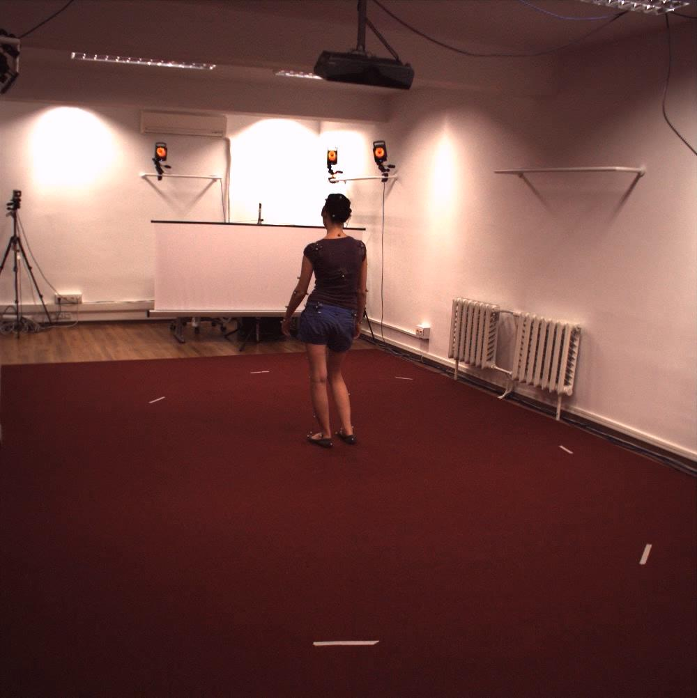
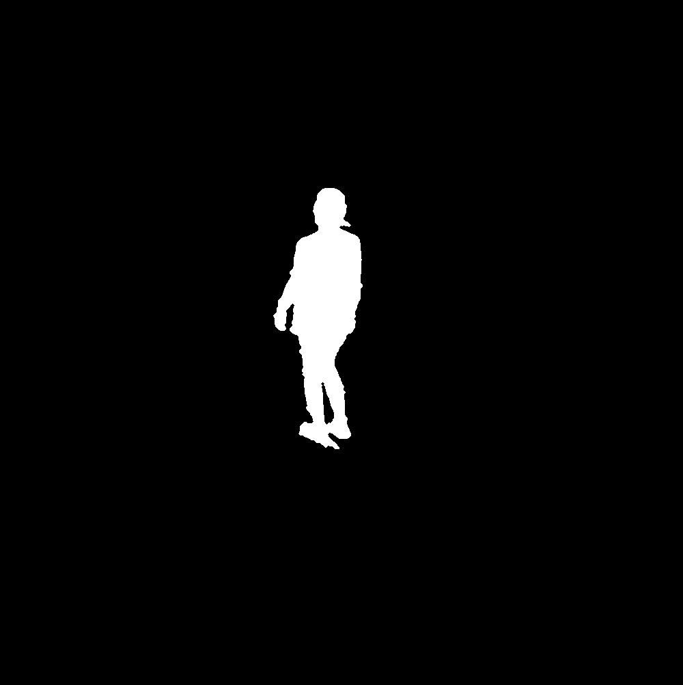
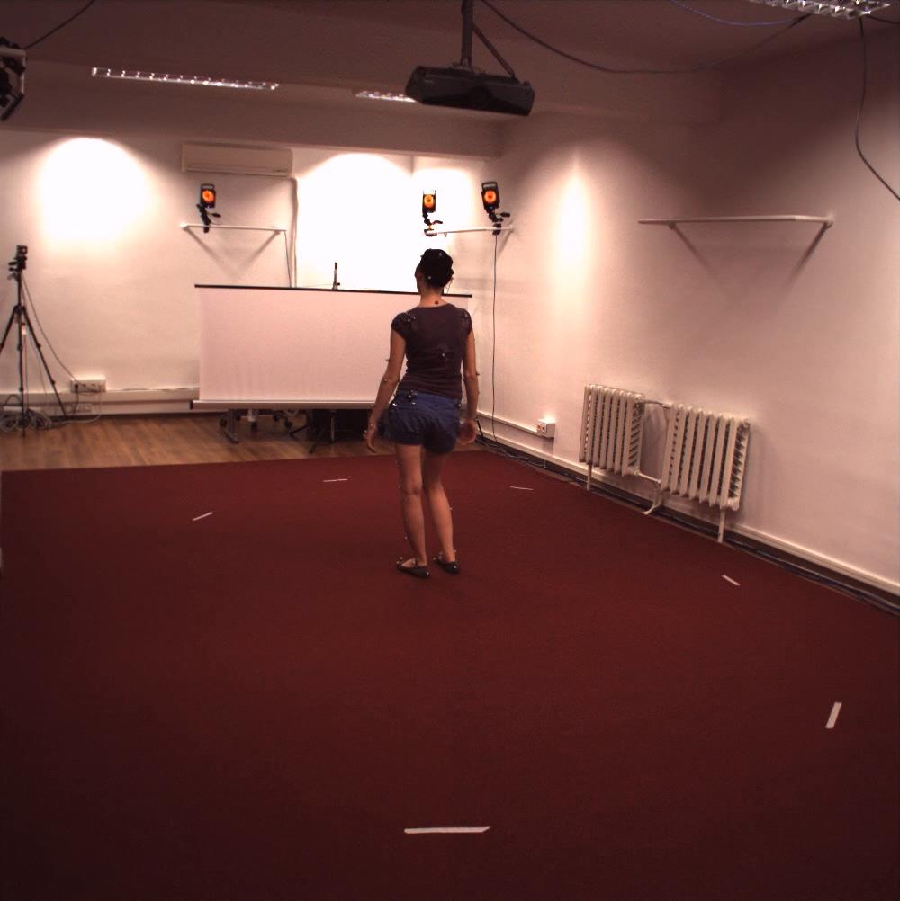
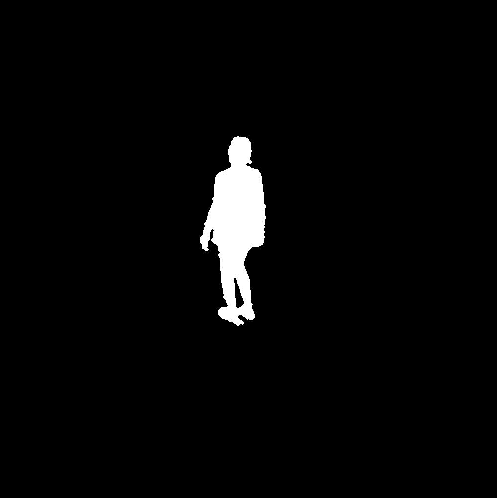
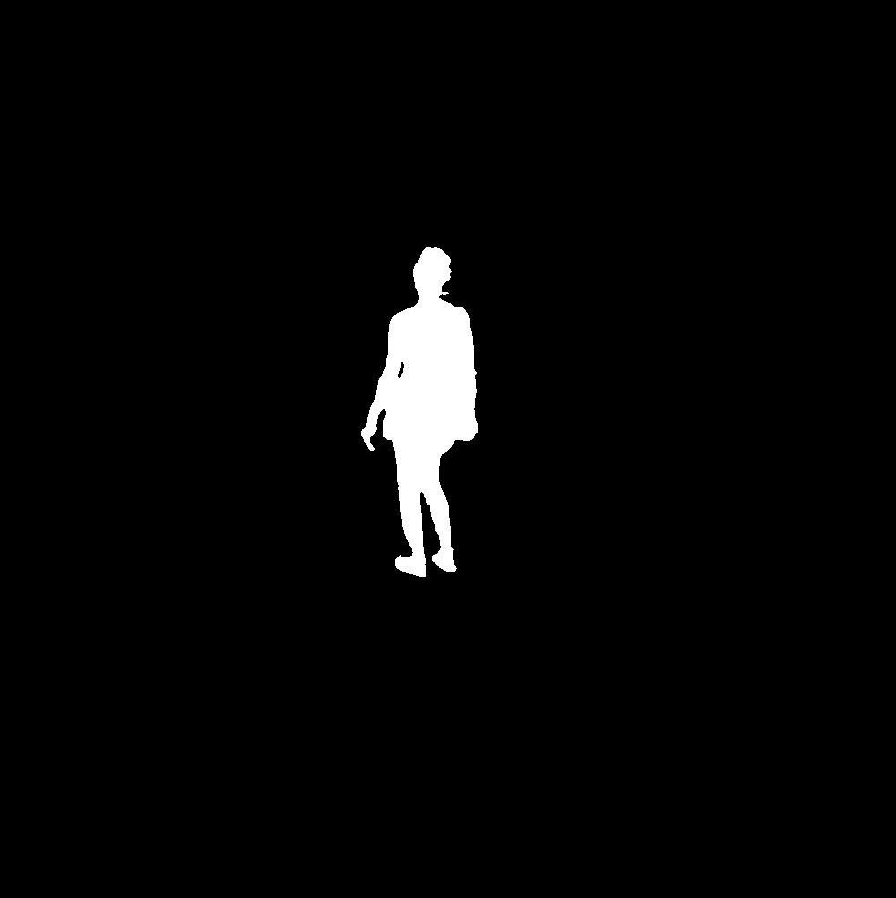

# CascadePSP: Toward Class-Agnostic and Very High-Resolution Segmentation via Global and Local Refinement

[Ho Kei Cheng*](https://hkchengrex.github.io/), Jihoon Chung*, Yu-Wing Tai, Chi-Keung Tang

[[arXiv]](https://arxiv.org/abs/2005.02551) [[PDF]](https://arxiv.org/pdf/2005.02551)

[[Supplementary Information (Comparisons with DenseCRF included!)]](https://openaccess.thecvf.com/content_CVPR_2020/supplemental/Cheng_CascadePSP_Toward_Class-Agnostic_CVPR_2020_supplemental.pdf)

[[Supplementary image results]](http://hkchengad.student.ust.hk/CascadePSP/CascadePSP-supp-images.pdf)


## Introduction

CascadePSP is a deep learning model for high-resolution segmentation refinement.
This repository contains our PyTorch implementation with both training and testing functionalities. We also provide the annotated UHD dataset **BIG** and the pretrained model.

Here are some refinement results on high-resolution images.


## Quick Start

Tested on PyTorch 1.0 -- though higher versions would likely work for inference as well.

Check out [this folder](https://github.com/hkchengrex/CascadePSP/tree/master/segmentation-refinement). We have built a pip package that can refine an input image with two lines of code.

Install with

```bash
pip install segmentation-refinement
```

Code demo:

```python
import cv2
import time
import matplotlib.pyplot as plt
import segmentation_refinement as refine
image = cv2.imread('test/aeroplane.jpg')
mask = cv2.imread('test/aeroplane.png', cv2.IMREAD_GRAYSCALE)

# model_path can also be specified here
# This step takes some time to load the model
refiner = refine.Refiner(device='cuda:0') # device can also be 'cpu'

# Fast - Global step only.
# Smaller L -> Less memory usage; faster in fast mode.
output = refiner.refine(image, mask, fast=False, L=900) 

# this line to save output
cv2.imwrite('output.png', output)

plt.imshow(output)
plt.show()
```

## Network Overview

### Global Step & Local Step

| Global Step | Local Step |
|:-:|:-:|
|  |  |


### Refinement Module



## Table of Contents

Running:

- [Installation](docs/installation.md)
- [Training](docs/training.md)
- [Testing on Semantic Segmentation](docs/testing_segmentation.md)
- [Testing on Scene Parsing](docs/testing_scene_parsing.md)

Downloads:

- [Pretrained Models](docs/models.md)
- [BIG Dataset and Relabeled PASCAL VOC 2012](docs/dataset.md)

## More Results

### Refining the masks of Human 3.6M

| Image | Original Mask | Refined Mask |
|:-:|:-:|:-:|
|  |  |  |
|  |  |  |
|  |  |  |

The first row is the failure case (see neck).

## Credit

PSPNet implementation: https://github.com/Lextal/pspnet-pytorch

SyncBN implementation: https://github.com/vacancy/Synchronized-BatchNorm-PyTorch

If you find our work useful in your research, please cite the following:

```bibtex
@inproceedings{cheng2020cascadepsp,
  title={{CascadePSP}: Toward Class-Agnostic and Very High-Resolution Segmentation via Global and Local Refinement},
  author={Cheng, Ho Kei and Chung, Jihoon and Tai, Yu-Wing and Tang, Chi-Keung},
  booktitle={CVPR},
  year={2020}
}
```
