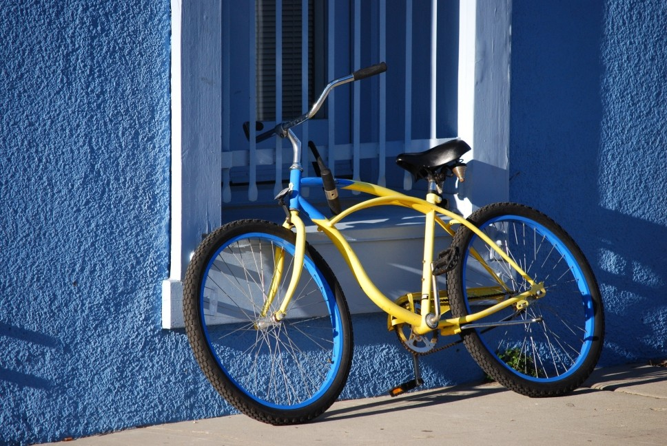

# Dataset

Here we provide our annotated dataset for evaluation, as well as segmentation results from other models. We do not hold the license for the RGB images. 

## BIG
BIG is a high-resolution segmentation dataset that has been hand-annotated by us. Images are collected from Flickr. Please do not use for commercial purposes.
BIG contains 50 validation objects, and 100 test objects with resolution ranges from 2048\*1600 to 5000\*3600. 

| Sample image  | Mask overlay |
| ------------- | ------------- |
|   |   |

(Downsampled to reduce file size here)

- [Google Drive](https://drive.google.com/open?id=1cLQvy1giJTSrHV4FGzXgadBgI0zNtIxN)
- [OneDrive](https://hkustconnect-my.sharepoint.com/:u:/g/personal/jchungaa_connect_ust_hk/EUHS22NrOSZEi5-FdhJM6zkB8wn3PUaKbUMLtWMHc0BbOg?e=CVEvSE)

## Relabeled PASCAL VOC 2012
We have relabeled 500 images from PASCAL VOC 2012 to have more accurate boundaries. 
Below shows an example of our relabeled segmentation.

- [Google Drive](https://drive.google.com/open?id=1vtkR05TTSQYu6XPrNr88sh3m7UxDazn2)
- [OneDrive](https://hkustconnect-my.sharepoint.com/:u:/g/personal/jchungaa_connect_ust_hk/EbtbHa40zNJDpNlD3UbDadQB4eG_dNfFI7YDit3OYOXAkw?e=Gmuaym)

## Segmentation Results

For convenience, we provide segmentation results from other models for evaluation. 
We tried our best to match the performance in their original papers, and use official code whenever available. 
<!-- These are NOT an official result from the authors of the paper.  -->
<!-- We recommend you to get the segmentation results manually from the original author's code release to test our model.  -->
<!-- We also include multi-scale evaluation  -->

| Segmentation |             | Refined  | Segmentation input  |    Source    |
|--------------|-------------|:---:|:-------------------------:|:-------------------------------:|
| BIG (Test)   | DeeplabV3+  | [Download](https://hkustconnect-my.sharepoint.com/:f:/g/personal/jchungaa_connect_ust_hk/Eh9zETGDiuVBjEFiUlk3tD4Bwm-_U7f-CoXFP8otJql0Kg?e=OhusVX)  | [Download](https://hkustconnect-my.sharepoint.com/:f:/g/personal/jchungaa_connect_ust_hk/Em8xxjDNRVNFpZaWwJV49NkBXxQwXd_AAIahQniAnq5IkQ?e=OwheVV) | [Link](https://github.com/tensorflow/models/tree/master/research/deeplab) |
|              | RefineNet   | [Download](https://hkustconnect-my.sharepoint.com/:f:/g/personal/jchungaa_connect_ust_hk/Eh9zETGDiuVBjEFiUlk3tD4Bwm-_U7f-CoXFP8otJql0Kg?e=OhusVX)  | [Download](https://hkustconnect-my.sharepoint.com/:f:/g/personal/jchungaa_connect_ust_hk/Em8xxjDNRVNFpZaWwJV49NkBXxQwXd_AAIahQniAnq5IkQ?e=OwheVV) | [Link](https://github.com/guosheng/refinenet) |
|              | PSPNet      | [Download](https://hkustconnect-my.sharepoint.com/:f:/g/personal/jchungaa_connect_ust_hk/Eh9zETGDiuVBjEFiUlk3tD4Bwm-_U7f-CoXFP8otJql0Kg?e=OhusVX)  | [Download](https://hkustconnect-my.sharepoint.com/:f:/g/personal/jchungaa_connect_ust_hk/Em8xxjDNRVNFpZaWwJV49NkBXxQwXd_AAIahQniAnq5IkQ?e=OwheVV) | [Link](https://github.com/hszhao/PSPNet) |
|              | FCN-8s      | [Download](https://hkustconnect-my.sharepoint.com/:f:/g/personal/jchungaa_connect_ust_hk/Eh9zETGDiuVBjEFiUlk3tD4Bwm-_U7f-CoXFP8otJql0Kg?e=OhusVX)  | [Download](https://hkustconnect-my.sharepoint.com/:f:/g/personal/jchungaa_connect_ust_hk/Em8xxjDNRVNFpZaWwJV49NkBXxQwXd_AAIahQniAnq5IkQ?e=OwheVV) | [Link](https://github.com/developmentseed/caffe-fcn/tree/master/fcn-8s) |
| PASCAL       | DeeplabV3+  | [Download](https://hkustconnect-my.sharepoint.com/:f:/g/personal/jchungaa_connect_ust_hk/Et_lRvsI_yZOnYCGZ7CTRIMBzIk8RZnXJ-W77QW0tjHSVQ?e=9bgo1a)  | [Download](https://hkustconnect-my.sharepoint.com/:f:/g/personal/jchungaa_connect_ust_hk/EhTt-3DzfdZHoRsjQEC8_xABjjQEHbK9rKgXE78btCfE0g?e=EvsRGH) | [Link](https://github.com/tensorflow/models/tree/master/research/deeplab) |
|              | RefineNet   | [Download](https://hkustconnect-my.sharepoint.com/:f:/g/personal/jchungaa_connect_ust_hk/Et_lRvsI_yZOnYCGZ7CTRIMBzIk8RZnXJ-W77QW0tjHSVQ?e=9bgo1a) | [Download](https://hkustconnect-my.sharepoint.com/:f:/g/personal/jchungaa_connect_ust_hk/EhTt-3DzfdZHoRsjQEC8_xABjjQEHbK9rKgXE78btCfE0g?e=EvsRGH) | [Link](https://github.com/guosheng/refinenet) |
|              | PSPNet      | [Download](https://hkustconnect-my.sharepoint.com/:f:/g/personal/jchungaa_connect_ust_hk/Et_lRvsI_yZOnYCGZ7CTRIMBzIk8RZnXJ-W77QW0tjHSVQ?e=9bgo1a) | [Download](https://hkustconnect-my.sharepoint.com/:f:/g/personal/jchungaa_connect_ust_hk/EhTt-3DzfdZHoRsjQEC8_xABjjQEHbK9rKgXE78btCfE0g?e=EvsRGH) | [Link](https://github.com/hszhao/PSPNet) |
|              | FCN-8s      | [Download](https://hkustconnect-my.sharepoint.com/:f:/g/personal/jchungaa_connect_ust_hk/Et_lRvsI_yZOnYCGZ7CTRIMBzIk8RZnXJ-W77QW0tjHSVQ?e=9bgo1a)  | [Download](https://hkustconnect-my.sharepoint.com/:f:/g/personal/jchungaa_connect_ust_hk/EhTt-3DzfdZHoRsjQEC8_xABjjQEHbK9rKgXE78btCfE0g?e=EvsRGH) | [Link](https://github.com/developmentseed/caffe-fcn/tree/master/fcn-8s) |

| Scene Parsing |    |  Refined | Pre-processed 'split' input(*) | Segmentation input   |      Source      |
|---------------|-----------|:---:|:---:|:-------------------------:|:-------------------------------:|
| ADE20K        | RefineNet | [Download](https://hkustconnect-my.sharepoint.com/:f:/g/personal/jchungaa_connect_ust_hk/EsL8uJtr681MjWqU-jwjz58BfuGzCWIlUKqNVma5qGpSig?e=iH0O1V) | [Download](https://hkustconnect-my.sharepoint.com/:f:/g/personal/jchungaa_connect_ust_hk/EmRNIu3b369Ogw5lpSXlN08BsN_k_GaY2rQnhUqCUdxm4A?e=W3wyli)| [Download](https://hkustconnect-my.sharepoint.com/:f:/g/personal/jchungaa_connect_ust_hk/EvIgfKbjdNdJkjchYL5GBgcBzNX5n4DoLWoLx2dJjFBWgA?e=wGGxNt) | [Link](https://github.com/guosheng/refinenet) |
|               | EncNet    | [Download](https://hkustconnect-my.sharepoint.com/:f:/g/personal/jchungaa_connect_ust_hk/EsL8uJtr681MjWqU-jwjz58BfuGzCWIlUKqNVma5qGpSig?e=iH0O1V) | [Download](https://hkustconnect-my.sharepoint.com/:f:/g/personal/jchungaa_connect_ust_hk/EmRNIu3b369Ogw5lpSXlN08BsN_k_GaY2rQnhUqCUdxm4A?e=W3wyli)| [Download](https://hkustconnect-my.sharepoint.com/:f:/g/personal/jchungaa_connect_ust_hk/EvIgfKbjdNdJkjchYL5GBgcBzNX5n4DoLWoLx2dJjFBWgA?e=wGGxNt) | [Link](https://github.com/zhanghang1989/PyTorch-Encoding) | 
|               | PSPNet    | [Download](https://hkustconnect-my.sharepoint.com/:f:/g/personal/jchungaa_connect_ust_hk/EsL8uJtr681MjWqU-jwjz58BfuGzCWIlUKqNVma5qGpSig?e=iH0O1V) | [Download](https://hkustconnect-my.sharepoint.com/:f:/g/personal/jchungaa_connect_ust_hk/EmRNIu3b369Ogw5lpSXlN08BsN_k_GaY2rQnhUqCUdxm4A?e=W3wyli)| [Download](https://hkustconnect-my.sharepoint.com/:f:/g/personal/jchungaa_connect_ust_hk/EvIgfKbjdNdJkjchYL5GBgcBzNX5n4DoLWoLx2dJjFBWgA?e=wGGxNt) | [Link](https://github.com/hszhao/semseg) | 

(*) Generated from segmentation input for our evaluation. 
