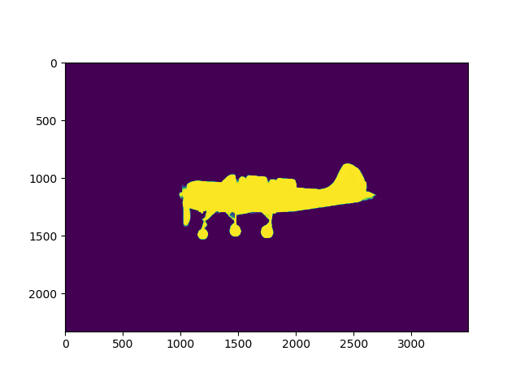

# Segmentation Refinement

This is an easy-to-use package version of the CVPR2020 paper [CascadePSP](https://github.com/hkchengrex/CascadePSP). It can refines a binary input segmentation of an image. For details, please refer to the complete repository linked above and the paper.

## Installation

Through pip:

```bash
pip install segmentation-refinement
```

or locally, 

```bash
pip install -e .
```

## Usage

The code has been tested on Ubuntu with PyTorch 1.4.

```python
import cv2
import time
import matplotlib.pyplot as plt
import segmentation_refinement as refine
image = cv2.imread('test/aeroplane.jpg')
mask = cv2.imread('test/aeroplane.png', cv2.IMREAD_GRAYSCALE)

# model_path can also be specified here
# This step takes some time to load the model
refiner = refine.Refiner(device='cuda:0') # device can also be 'cpu'

# Fast - Global step only.
# Smaller L -> Less memory usage; faster in fast mode.
output = refiner.refine(image, mask, fast=False, L=900) 

plt.imshow(output)
plt.show()
```

The pre-trained model will be downloaded automatically.

Output (4.77s):


Output (fast, 0.45s):


